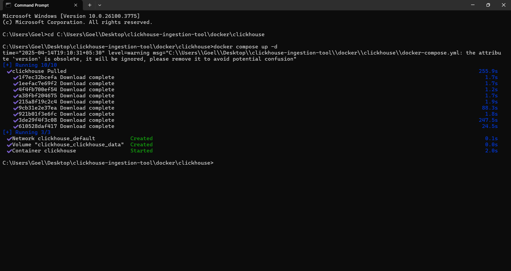
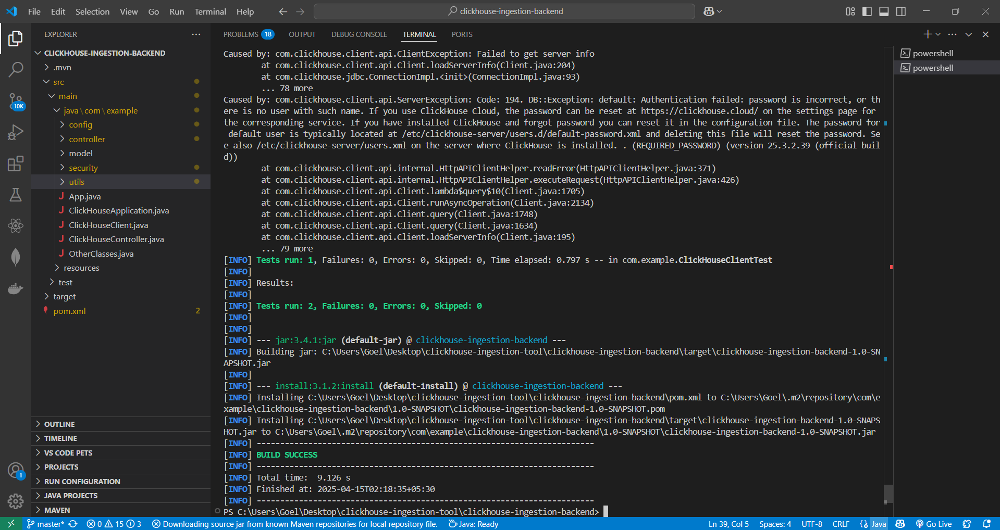
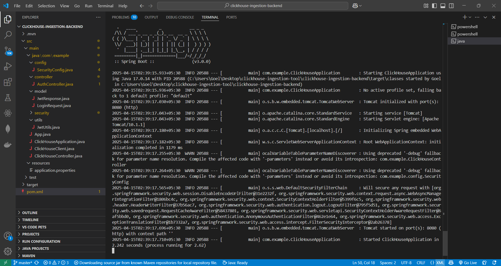
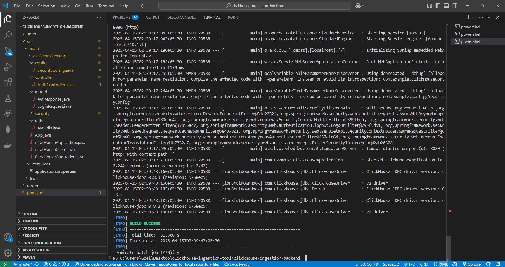

# ClickHouse Ingestion Tool

## Overview
The **ClickHouse Ingestion Tool** is a full-stack application designed to facilitate **bidirectional data ingestion** between **ClickHouse** and **flat files** (e.g., CSV, TSV) using a **Spring Boot** backend and a **React** frontend. It supports features such as **schema discovery**, **column selection**, **JWT-based authentication**, and **data export**.

---

## Features
- **Bidirectional Data Ingestion**: Ingest data from flat files into ClickHouse and vice versa.
- **Schema Discovery**: Dynamically fetch and display the schema of ClickHouse tables.
- **Column Selection**: Allow users to select specific columns for ingestion.
- **JWT Authentication**: Secure the application with JWT tokens for authorization.
- **File Export**: Export data from ClickHouse to flat files (CSV).

---

## Tech Stack
- **Backend**: Spring Boot (Java)
- **Frontend**: React
- **Database**: ClickHouse
- **Authentication**: JWT (JSON Web Tokens)
- **UI Framework**: Bootstrap/Material UI (choose whichever you use)
- **Build Tool**: Maven

---

## Screenshots

### 1. ClickHouse

### 2. mvn Success

### 3. Spring-Boot Init

### 4. Spring-Boot Success

